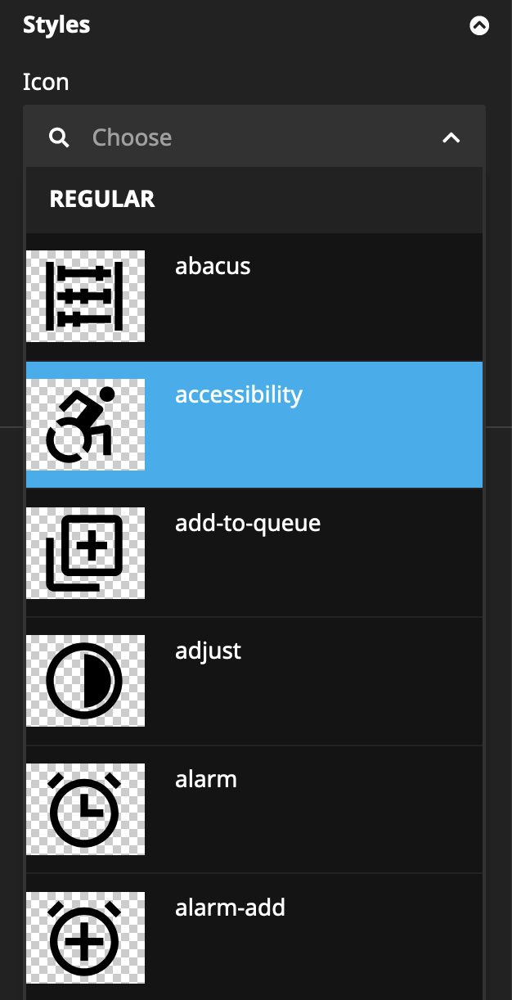

# Neos CMS Boxicons Plugin

Boxicons Metadata Version: **2.1.4**

Plugin to add a Boxicons icon selector to your nodetypes. It also provides a default Boxicons icon nodetype.

### Disable Icon Groups
You can disable Icon groups (like logos) with the `styles` setting. 
```
Aim29:
  Boxicons:
    Icon:
      styles:
        regular: true
        solid: true
        logos: false # Disable Logo Icons
```

## Screenshots
